## Final Project

Authors: Abigail Starkweather, Kelly Feke  
This page describes a project developed for CSCI 711 Global Illumination.

### Intro  
#### Goal  
- Create a stained glass window scene using our own python raytracer  
- There will be a stained glass window object with a pattern of colors  
- Light will shine through the window and project colors of the window onto the floor  
#### Inspiration Picture
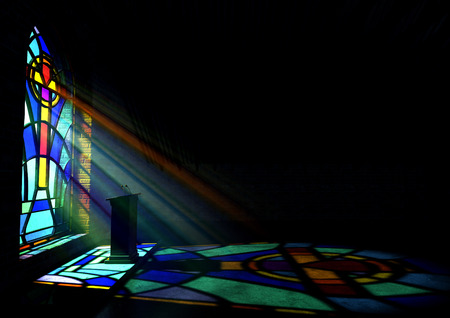  

### Architecture  
#### What we had to begin with  
We will be using the raytracer that we have built in the course CSCI 711 Global Illumination. We already had basic raytracing implemented with objects, light sources, Phong materials, and reflection.  
#### What we needed  
- Image texture to apply a stained glass image onto the glass object material using uv mapping.  
- Refraction / Transmission using Snell's Law to allow the glass object to appear as glass have allow light to go through it. We should be able to see through the window even though it is colored.  
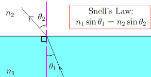  
- Beer's Law for absorption of light. When the light hits the window, some light should be absorbed by the window before passing through.  
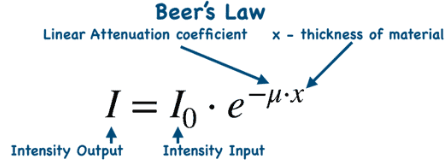  
- We want the light that does go through the window to change color based on the glass' color. Transmission is the base idea — the material lets light pass through. Absorption (Beer's law) explains how much of each color survives based on absorption coefficients per wavelength and thickness of the window object. Without absorption, the light color is unchanged.  
### System  
We implemented the following in our world's spawn_ray function.  
- Snell's Law:  
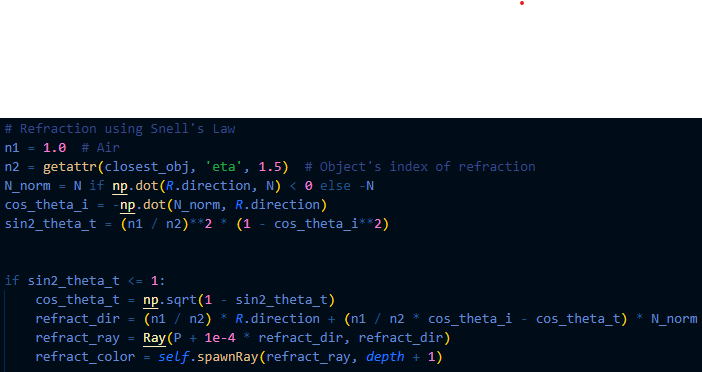
- Color Filter:  
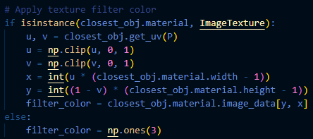
- Beer's Law:  
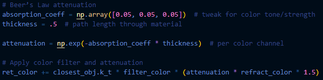
We also created a material for image texture that implements uv mapping and phong illumination. We drew an image to project.
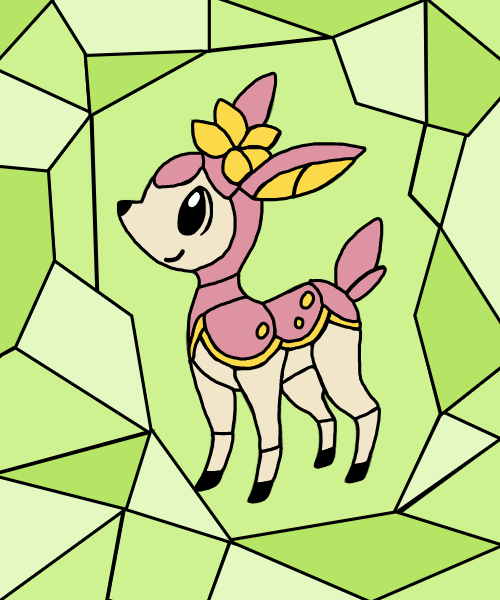  
We also created a glass material that uses phong, k_t=.6 and eta=1.5. We generated triangles with this material to create another stained glass window. We hand-calculated the points of the triangles for this window.  
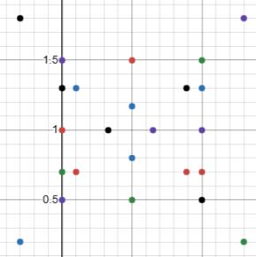

### Results  
Our first attempt used the image-textured object for the window. The image successfully was textured.  
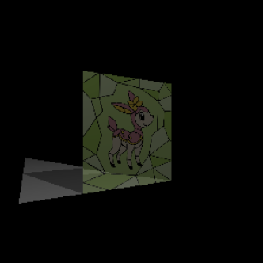  
We implemented the shadow-attenuation but got unexpected results. We assume the uv-mapping of the triangular objects that the image is textured onto is manipulating the shadows.  
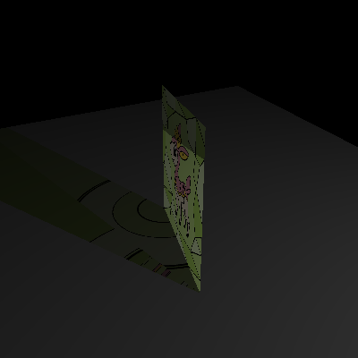    
We pivoted to creating the scene with glass texture objects using separated triangles.
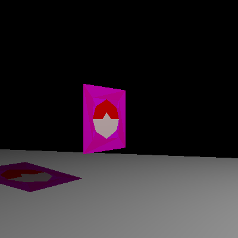  
We can move the light to change the position of the shadow on the floor.  
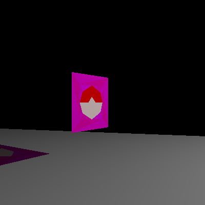  
We can also move the camera to get a different view of the image.  
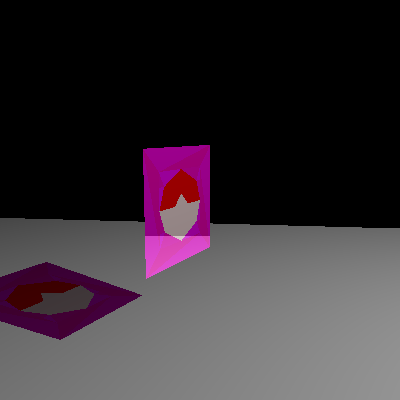  
Since we cannot see the colored rays coming from the window, we include this image to prove the rays are in fact there, just not seeable.
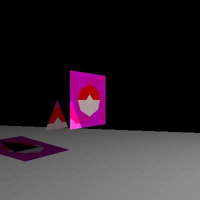

### Future Work  
#### Colored Rays  
In our inspiration image, you can view the actual light rays being colored from the window. We want to achieve this effect, but this would require volumetrics. This would create particles in the air that the light could bounce off of to actually show the colored rays.  
#### Window Pane  
We want to be able to successfully use our image texture, and we hypothesize that implementing a proper pane object would fix our warped shadows. Right now, the image is on two separate triangles which can be seen in the colored shadow.  
#### Improve Glass Texture  
We want to experiment with our absorption coefficients and thickness to make the effect of glass more realistic. This affects the colored light transmitted through. We also would like to make the glass texture itself better than just a glorified phong by adding random noise to the glass.  

